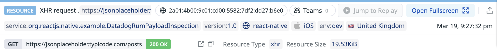
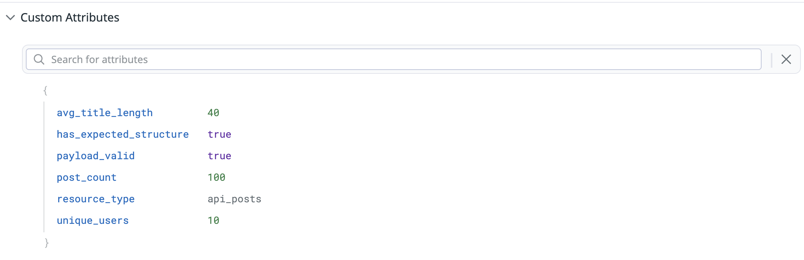

# Datadog RUM React Native — Payload Inspection Example

A quick, vibe-coded React Native example demonstrating how to add URL-specific attribute context into Datadog RUM based on response payload content, URL pathing, and other request metadata.

> **Note:** This is not intended as a best-practice approach. It is purely an example of how payload inspection and custom RUM attributes *could* work for customer use cases.

## What It Does

The app fetches data from the [JSONPlaceholder](https://jsonplaceholder.typicode.com/) API, inspects the response payload, and sends custom attributes to Datadog RUM using manual `DdRum.startResource()`/`stopResource()` instrumentation. This includes:

- **Payload validation** — checks the structure/schema of the response
- **Computed metadata** — post count, unique users, average title length, structure validity
- **Custom RUM attributes** — all metadata is attached as custom attributes on the RUM resource event
- **Error categorisation** — distinguishes network errors from parse/validation errors in RUM

## Screenshots

### RUM Resource Request


### Custom Metadata Attributes


## Getting Started

> Make sure you have completed the [React Native Environment Setup](https://reactnative.dev/docs/set-up-your-environment) guide before proceeding.

### Prerequisites

- Node >= 22.11.0
- A `credentials.json` file with your Datadog `clientToken`, `applicationId`, and `environment` (see `credentials.example.json` for the template)

### Running the App

```sh
# Start Metro dev server
npm start

# Run on iOS (in a separate terminal)
npm run ios

# Run on Android (in a separate terminal)
npm run android
```

For iOS, install CocoaPods dependencies first:

```sh
bundle install
bundle exec pod install
```

## Architecture

- **`App.tsx`** — Root component wrapping the app with `DatadogProvider`
- **`src/MainScreen.tsx`** — Single-screen UI with a FETCH button that triggers the instrumented API call and displays results
- **`src/fetchWithRum.ts`** — Core logic: fetch, validate, compute metadata, and report to RUM with custom attributes

## Key Design Decisions

- **Manual RUM instrumentation** — `trackResources` is set intentionally to control exactly what gets reported, rather than relying on auto-tracking
- **Credentials via JSON file** — `credentials.json` is gitignored; never commit it
